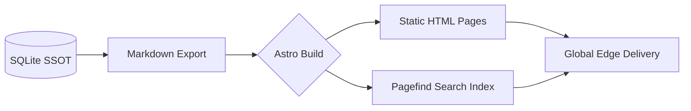

<div align="center">


# CCUS Policy Hub

### Global Intelligence Infrastructure for Carbon Capture, Utilization, and Storage

[](https://github.com/liuh886/ccus-policy-hub/actions)
[](https://astro.build)
[](LICENSE)

[**English**] | [**简体中文 (Chinese Version)**](./README.zh.md) | [**Live Demo**](https://liuh886.github.io/ccus-policy-hub/)

</div>

---

## CCUS Policy Hub

**The open-source bridge between fragmented regulatory texts and actionable global CCUS insights.**

## 🌟 Overview

**CCUS Policy Hub** is a professional-grade, open-source knowledge infrastructure dedicated to the global CCUS sector. It bridges the gap between fragmented regulatory texts and actionable data insights by integrating the **IEA Global Facilities Database** with **GCCSI Policy & Legal Readiness (PLR) indicators**.

Our mission is to provide researchers, policymakers, and investors with a high-fidelity tool for benchmarking CCUS incentives and regulatory frameworks worldwide.

---

## ✨ Key Features

### 1. Global Policy Access Console

Navigate through an interactive world map to instantly access regional frameworks. We cover **35+ core economies**, providing live data on incentives and entry requirements.

> **Feature Highlight**: Real-time policy count tracking and regional intensity heatmaps.

### 2. PLR 3.0 Comparative Matrix

Go beyond simple dollar-per-ton comparisons. Our advanced matrix allows side-by-side benchmarking of:

- **Pore Space Rights**: Ownership of underground storage volumes.
- **Liability Transfer**: Timelines for long-term stewardship handover.
- **CO2 Definition**: Legal classification (Waste vs. Commodity).
- **Permitting Lead Times**: Estimated timelines for regulatory approval.

### 3. Facility-Policy Intelligence

Every facility in our 800+ project database is automatically mapped to its governing national regulations. Clicking a project like "Northern Lights" or "Daqing Aonan" will show the specific legal clauses and financial incentives that support it.

---

## 🏗️ Technical Architecture

The platform is built on a **Data-Driven SSG (Static Site Generation)** architecture, ensuring extreme performance and high data provenance.



- **SSOT (Single Source of Truth)**: `governance/db/ccus_master.sqlite` is the governance source of truth.
- **Published Content Layer**: `src/content/policies/{en,zh}` and `src/content/facilities/{en,zh}` are exported build inputs.
- **Astro 5**: Leverages the latest content layer API for high-performance rendering.
- **Pagefind**: Provides ultra-fast full-text search without a backend server.

---

## 🛠️ Development & Maintenance

### Setup

```bash
git clone https://github.com/liuh886/ccus-policy-hub.git
cd ccus-policy-hub
pnpm install
pnpm dev
```

### Data Governance

We maintain a strict **Database Governance Protocol** to prevent encoding issues and ensure bilingual consistency.

- Governance edits should be made in `SQLite` (`governance/db/ccus_master.sqlite`) and exported to Markdown.
- `src/content/.../*.md` is treated as generated/published content for the site build.
- Reverse sync (`Markdown -> SQLite`) is migration-only and requires explicit acknowledgement.

---

<div align="center">
  <sub>Built with ❤️ for the Global Climate Community by <b>liuh886</b></sub>
</div>
