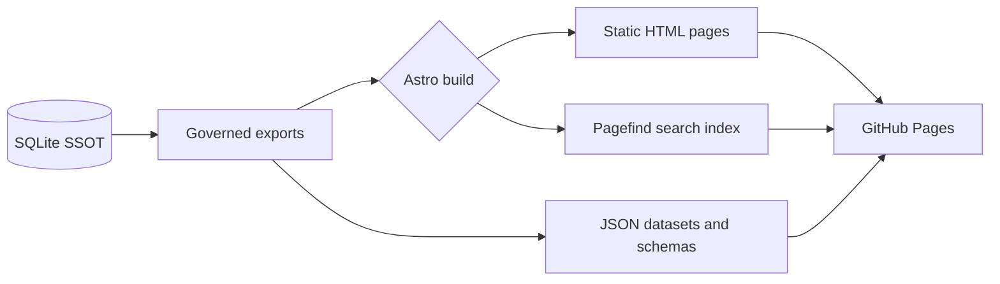

<div align="center">


# CCUS Policy Hub

### Evidence-backed global intelligence for carbon capture, utilization, and storage

[](https://github.com/liuh886/ccus-policy-hub/actions)
[](https://astro.build)
[](LICENSE)
[](https://doi.org/10.5281/zenodo.21110615)

[**English**] | [**简体中文**](./README.zh.md) | [**Live Demo**](https://liuh886.github.io/ccus-policy-hub/)

</div>

---

## Overview

**CCUS Policy Hub** is an open-source knowledge and decision-support infrastructure for global carbon capture, utilization, and storage policy. It converts fragmented regulatory texts, country governance characteristics, and facility records into structured, bilingual, auditable datasets for researchers, policymakers, project developers, investors, and AI systems.

The project is designed around a trust-first principle: structured data and provenance establish the factual boundary, while analytical interfaces and future AI agents operate within that boundary rather than replacing it.

### Current governed snapshot

- **130 policy records**, including **116 verified** and **14 draft** records;
- **1,110 facility records** from the 2026-Q2 facility dataset and curated ingestion;
- **66 country governance profiles**;
- bilingual Chinese and English publication coverage;
- machine-readable JSON endpoints, schemas, quality metrics, and dataset versions.

Counts describe the governed datasets. Individual website views may show narrower subsets because of publication, review, status, or analytical filters.

> **AI-ready infrastructure:** The Hub provides a governed grounding source for climate-policy agents through static data endpoints, schemas, quality indicators, and explicit known limitations.

---

## OpenAI Build Week

The Build Week product track is:

### CCUS Policy Hub: Project Readiness Agent

> An evidence-backed AI agent that turns fragmented CCUS regulations into project-ready decisions, comparing jurisdictions, incentives, permits, liabilities and policy gaps with traceable sources.

The proposed agent will extend the existing Hub rather than operate as a disconnected chatbot. A user will describe a proposed CCUS project and receive a structured readiness brief with cited evidence, confidence labels, and explicit unresolved gaps.

See [BUILD_WEEK.md](BUILD_WEEK.md) for the submission baseline, scope split, and non-negotiable trust rules.

---

## Key capabilities

### 1. Global policy access and comparison

Explore policy records and country governance profiles through maps, search, and comparison views. The platform supports structured comparison of incentives, statutory requirements, market mechanisms, strategy, technical governance, and seven regulatory pillars.

### 2. Facility and capacity intelligence

Explore **1,110 CCUS facility records** by geography, status, value-chain type, timing, and recorded capacity. Capacity charts are explicitly described as project-record aggregations and should not be interpreted as net deliverable capture or storage capacity.

### 3. Country governance profiles

Compare national governance conditions including:

- pore-space rights;
- liability transfer and liability periods;
- financial assurance;
- permitting lead times;
- the regulatory position of CO₂;
- cross-border transport rules.

### 4. Facility-policy context with confidence labels

Facilities are associated with policies through the current relationship model. At present, the published links are **country-level contextual associations** with low confidence. They indicate that a facility and policy share a jurisdiction; they do not by themselves prove that a particular clause directly enabled, financed, or governs a particular facility.

The relationship model supports a future progression from:

| Level    | Confidence   | Meaning                                                      |
| -------- | ------------ | ------------------------------------------------------------ |
| Country  | Low (0.3)    | Facility and policy share a jurisdiction                     |
| Sector   | Medium (0.6) | Policy scope matches the facility sector or value-chain role |
| Evidence | High (0.9)   | A source directly connects the policy and facility           |

See [Facility-Policy Relationship Model](docs/facility-policy-relationship-model.md).

### 5. Data trust and auditability

The quality layer exposes rather than hides known gaps, including missing sources or URLs, coordinate precision, review status, capacity completeness, and relationship confidence.

Visit the [Quality Dashboard](https://liuh886.github.io/ccus-policy-hub/quality/).

---

## Technical architecture

The platform uses a data-driven static-site architecture for reproducible publishing and high-performance access.


```mermaid
graph LR
    A[(SQLite SSOT)] --> B[Governed exports]
    B --> C{Astro build}
    C --> D[Static HTML pages]
    C --> E[Pagefind search index]
    B --> F[JSON datasets and schemas]
    D --> G[GitHub Pages]
    E --> G
    F --> G
```

- **Single source of truth:** `agent/ccus-ai-agent/db/ccus_master.sqlite`.
- **One-way publishing:** SQLite → governed Markdown and JSON exports.
- **Astro 5:** static content and analytical pages.
- **Pagefind:** static full-text search without a runtime search backend.
- **Quality gates:** lint, tests, type checks, deep database audit, governed exports, and build validation.

---

## Machine-readable data interface

| Endpoint                      | Description                                              |
| ----------------------------- | -------------------------------------------------------- |
| `/data/manifest.json`         | Dataset, schema, and documentation index                 |
| `/data/policies.json`         | Structured CCUS policy records and analysis fields       |
| `/data/facilities.json`       | Facility records, locations, status, and capacity fields |
| `/data/countries.json`        | Country governance profiles and regulatory pillars       |
| `/data/quality.json`          | Quality metrics and audit status                         |
| `/data/dataset-versions.json` | Dataset version metadata                                 |
| `/llms.txt`                   | Concise orientation for AI systems                       |
| `/llms-full.txt`              | Extended field and limitation documentation              |

JSON Schemas are published under `/data/schemas/`.

### Known limitations

- Facility-policy links are currently country-level contextual associations.
- Coordinate precision varies between exact, state-level, and country-level anchors.
- Some policy records are missing an original source or URL.
- Some facility records do not contain a usable estimated-capacity value.
- Policy status and applicability can change after the recorded audit date.

Consumers should inspect `/data/quality.json` and `/data/dataset-versions.json` before relying on a dataset snapshot.

---

## Development

```bash
git clone https://github.com/liuh886/ccus-policy-hub.git
cd ccus-policy-hub
pnpm install
pnpm dev
```

### Data governance workflow

Governance changes should be made in SQLite and exported through the maintained scripts. Files under `src/content/` and `public/data/` are publication artifacts, not independent sources of truth.

Core checks:

```bash
pnpm lint
pnpm test
pnpm astro check
pnpm manage:db:audit:deep
pnpm manage:db:quality:export
pnpm manage:db:data:export
pnpm build
```

GitHub Pages deployment runs the same blocking trust checks before publishing.

---

## Citation

If you use **CCUS Policy Hub** in research, policy analysis, or derivative datasets, cite the archived Zenodo record:

> Liu, Z. **CCUS Policy Hub: Global Intelligence Infrastructure for Carbon Capture, Utilization, and Storage**. Zenodo. https://doi.org/10.5281/zenodo.21110615

```bibtex
@software{liu_ccus_policy_hub,
  author = {Liu, Zhihao},
  title = {CCUS Policy Hub: Global Intelligence Infrastructure for Carbon Capture, Utilization, and Storage},
  publisher = {Zenodo},
  doi = {10.5281/zenodo.21110615},
  url = {https://doi.org/10.5281/zenodo.21110615}
}
```

---

<div align="center">
  <sub>Built for the global climate and CCUS community by <b>liuh886</b></sub>
</div>
