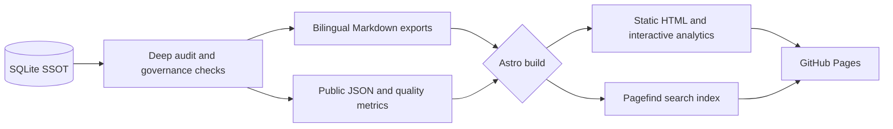
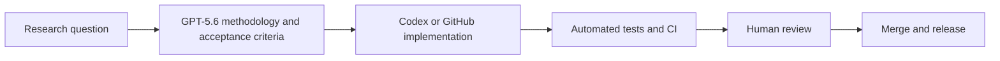

<div align="center">


# CCUS Policy Hub

### Global intelligence infrastructure for carbon capture, utilization, and storage

[](https://github.com/liuh886/ccus-policy-hub/actions)
[](https://astro.build)
[](LICENSE)
[](https://doi.org/10.5281/zenodo.21110615)

[**English**] | [**简体中文**](./README.zh.md) | [**Live Demo**](https://liuh886.github.io/ccus-policy-hub/)

</div>

---

## Overview

**CCUS Policy Hub** is an open-source research and data platform for comparing CCUS policy frameworks, facility deployment, project-record capacity, and governance maturity across countries and regions.

It connects three layers that are usually studied separately:

- **Policy and regulation**: incentives, legal frameworks, permitting, liability, MRV, and cross-border rules.
- **Facility and project records**: status, type, sector, region, capacity, location, hub, partners, and key dates.
- **Governance and deployment analytics**: country benchmarking, regional project pipelines, committed capacity, and data-quality evidence.

The platform is designed for researchers, policymakers, market analysts, investors, and AI agents that need a structured and auditable grounding source rather than a collection of disconnected webpages.

## Dataset Snapshot

| Dataset | Current snapshot |
| --- | ---: |
| Policies | **130** |
| Facility records | **1,110** |
| Country governance profiles | **66** |
| Facility dataset version | **2026-Q2** |
| Policy review status | **Active** |
| Last checked | **2026-06-24** |

> Counts describe records in the published dataset. A facility record is not always equivalent to one unique real-world project, especially where capture, transport, storage, and full-chain components are represented separately.

## What the Platform Helps Answer

- How do CCUS incentives, permitting systems, storage rights, liability rules, and MRV arrangements differ across jurisdictions?
- Where are operational, under-construction, and planned facility records concentrated?
- How much publicly recorded capacity is still planned, and how much has reached construction or operation?
- Which regions combine stronger governance capability with greater deployment scale?

---

## Core Capabilities

### 1. Global Policy Access Console

Navigate an interactive world map to review country and regional policy frameworks, market-access conditions, incentive mechanisms, legal weight, and policy status.

- Bilingual policy content in English and Chinese.
- Structured policy categories and analysis dimensions.
- Build-time policy counts and regional coverage indicators.
- Direct access to policy details, sources, dates, and related facilities.

### 2. Global Facility Intelligence

Explore the published facility dataset through maps, filters, searchable cards, and project-level pages.

- Filter by country, region, sector, status, and facility type.
- Review project-record capacity, coordinates, precision, hub, operator, partners, and key dates.
- Distinguish operational, under-construction, planned, cancelled, suspended, and decommissioned records.
- Inspect the data-quality and provenance fields available for each record.

### 3. CCUS Project-Record Capacity Growth

The homepage time-series workspace shows how recorded CCUS capacity accumulates across the project pipeline.

- Adjustable time window from historical records to announced future projects.
- Type filters for Capture, Transport, T&S, Storage, Full chain, and CCU.
- Two consistent series:
  - **Pipeline** = Planned + Under construction + Operational.
  - **Committed** = Under construction + Operational.
- The active rightmost year drives the headline project-record capacity figure.
- Record year priority follows **operation → FID → announcement**.

> Project-record capacity is an aggregation of published records. It should not be interpreted as net deliverable capture capacity or net geological storage capacity.

### 4. 2026 Global Project Landscape

A current dataset snapshot complements the time series with project maturity and regional concentration.

- **Projects by Status**: operational, under-construction, and planned records within the active portfolio.
- **Pipeline vs Committed by Region**: nested regional bars make the subset relationship explicit.
- Toggle between **recorded capacity** and **project count**.
- Automatically generated insights for:
  - Global committed share.
  - Largest pipeline region.
  - Largest committed region.
  - Capacity-data coverage.

Cancelled, suspended, and decommissioned records are disclosed separately rather than mixed into the active portfolio.

### 5. Governance Benchmarking & Deployment Comparison

The comparison workspace goes beyond a single readiness score and exposes the structure behind national governance capability.

- Side-by-side comparison of regulatory pillars, including pore-space rights, liability transfer, financial assurance, permitting, CO₂ legal status, and cross-border rules.
- Governance benchmarking across selected countries.
- Governance–Deployment Matrix connecting institutional capability with project-record deployment scale.
- Global maturity views for identifying governance leaders, deployment leaders, and implementation gaps.
- Method notes and evidence boundaries presented alongside the visual analysis.

### 6. Trust, Quality, and AI-Readable Data

The platform treats data governance as a product capability, not a back-office process.

- SQLite single source of truth.
- Bilingual export and parity checks.
- Blocking deep-audit checks in CI.
- Public quality dashboard and dataset-version metadata.
- Static JSON endpoints and JSON Schemas.
- `llms.txt` and `llms-full.txt` documentation for AI agents.

---

## Methodology and Limitations

### Project-record methodology

- Capacity is derived from the maintained estimated value when available, otherwise from the announced range according to the repository's capacity rules.
- Records without a usable capacity remain in project-count views but contribute `0 Mtpa` to capacity aggregations.
- Summing across capture, transport, storage, and full-chain records may include different components of the same wider value chain.
- Project-record totals are therefore analytical indicators, not net physical system capacity.

### Snapshot methodology

- The **2026 Global Project Landscape** describes the current state of the 2026 dataset snapshot.
- It does not mean that all displayed projects were announced, built, or commissioned in 2026.
- Current status fields should not be used as a historical reconstruction of what a project's status was in an earlier year.

### Facility-policy relationship confidence

Facility records are linked to relevant jurisdiction-level policy frameworks to provide governance context. These links should not be interpreted as verified project-specific legal applicability unless direct evidence is available.

| Relationship level | Indicative confidence | Meaning |
| --- | ---: | --- |
| Country | Low | Facility and policy share the same jurisdiction |
| Sector | Medium | Facility sector matches the documented policy scope |
| Direct evidence | High | A source explicitly connects the policy and facility |

See the [Facility-Policy Relationship Model](docs/facility-policy-relationship-model.md) for the full design.

### Geographic precision

Coordinates may represent exact, state-level, or country-level locations. Country-level coordinates are visualization anchors and must not be interpreted as verified project sites.

---

## Data Architecture

The platform uses a data-governed static-site architecture: the website is static, while its source data is maintained through an auditable database workflow.


```mermaid
graph LR
    A[(SQLite SSOT)] --> B[Deep audit and governance checks]
    B --> C[Bilingual Markdown exports]
    B --> D[Public JSON and quality metrics]
    C --> E{Astro build}
    D --> E
    E --> F[Static HTML and interactive analytics]
    E --> G[Pagefind search index]
    F --> H[GitHub Pages]
    G --> H
```

- **SSOT**: `agent/ccus-ai-agent/db/ccus_master.sqlite`.
- **Published content layer**: `src/content/policies/{en,zh}` and `src/content/facilities/{en,zh}`.
- **Public data layer**: `public/data/*.json` and `public/data/schemas/`.
- **Frontend**: Astro 5, Tailwind CSS, Chart.js, Leaflet, and Pagefind.
- **Deployment**: static output published through GitHub Pages.

---

## AI-Readable Data Interface

Static endpoints are available for AI agents, researchers, and scripts:

| Endpoint | Description |
| --- | --- |
| `/data/manifest.json` | Dataset, schema, and documentation index |
| `/data/policies.json` | 130 policy records with analysis data |
| `/data/facilities.json` | 1,110 facility records with capacity and location data |
| `/data/countries.json` | 66 governance profiles with regulatory pillars |
| `/data/quality.json` | Quality metrics and audit status |
| `/data/dataset-versions.json` | Dataset version and last-checked metadata |
| `/data/schemas/` | JSON Schemas for validation |
| `/llms.txt` | Concise AI-agent documentation |
| `/llms-full.txt` | Extended data and field documentation |

Recommended usage:

1. Fetch `/data/manifest.json` to discover the available resources.
2. Validate records against the published schemas.
3. Check `/data/quality.json` and version metadata before drawing conclusions.
4. Preserve methodology notes when using capacity or relationship fields.

---

## Development and Data Governance

### Local setup

```bash
git clone https://github.com/liuh886/ccus-policy-hub.git
cd ccus-policy-hub
pnpm install
pnpm dev
```

### Validation and production build

```bash
pnpm lint
pnpm test
pnpm astro check
pnpm manage:db:audit:deep
pnpm manage:db:quality:export
pnpm manage:db:data:export
pnpm build
```

### Governed content workflow

```text
SQLite edit
  → deep audit
  → bilingual Markdown export
  → quality and public-data generation
  → Astro production build
  → human review and deployment
```

Governance rules:

- Make authoritative content changes in SQLite, not directly in generated Markdown.
- Treat `src/content/**/*.md` as the publication layer.
- Reverse synchronization from Markdown to SQLite is migration-only and requires explicit acknowledgement.
- Preserve provenance, audit dates, bilingual parity, and source URLs when updating records.

---

## AI-Assisted Development

The project uses AI as a research and engineering copilot within a human-reviewed workflow.

### GPT-5.6

- Helps define analytical methodology, metric boundaries, and acceptance criteria.
- Reviews governance and deployment logic for conceptual consistency.
- Designs bilingual information architecture, product copy, and visual QA requirements.
- Translates research judgments into implementation tasks, tests, and PR review criteria.

### Codex and repository agents

- Inspect the current GitHub repository and implement focused changes.
- Create and update pull requests, tests, and documentation.
- Diagnose Astro, TypeScript, data-pipeline, and CI failures.
- Hand off environment-specific validation to local Codex workflows when needed.


```mermaid
graph LR
    A[Research question] --> B[GPT-5.6 methodology and acceptance criteria]
    B --> C[Codex or GitHub implementation]
    C --> D[Automated tests and CI]
    D --> E[Human review]
    E --> F[Merge and release]
```

AI-generated changes are not accepted solely because they compile. Data definitions, evidence, and release decisions remain subject to maintainer review.

---

## Citation

If you use **CCUS Policy Hub** in research, policy analysis, or derivative datasets, please cite the archived Zenodo record:

> Liu, Z. **CCUS Policy Hub: Global Intelligence Infrastructure for Carbon Capture, Utilization, and Storage**. Zenodo. https://doi.org/10.5281/zenodo.21110615

```bibtex
@software{liu_ccus_policy_hub,
  author = {Liu, Zhihao},
  title = {CCUS Policy Hub: Global Intelligence Infrastructure for Carbon Capture, Utilization, and Storage},
  publisher = {Zenodo},
  doi = {10.5281/zenodo.21110615},
  url = {https://doi.org/10.5281/zenodo.21110615}
}
```

## License

Code is released under the [MIT License](LICENSE). Dataset records retain their original source attribution and should be reused with the methodology and provenance limitations described above.

---

<div align="center">
  <sub>Built for the global climate and CCUS research community by <b>liuh886</b></sub>
</div>
