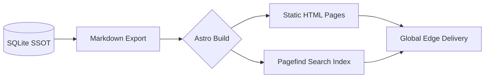

<div align="center">


# CCUS Policy Hub

### Global Intelligence Infrastructure for Carbon Capture, Utilization, and Storage

[](https://github.com/liuh886/ccus-policy-hub/actions)
[](https://astro.build)
[](LICENSE)
[](https://doi.org/10.5281/zenodo.21110615)

[**English**] | [**简体中文 (Chinese Version)**](./README.zh.md) | [**Live Demo**](https://liuh886.github.io/ccus-policy-hub/)

</div>

---

## CCUS Policy Hub

**The open-source bridge between fragmented regulatory texts and actionable global CCUS insights.**

## 🌟 Overview

**CCUS Policy Hub** is a professional-grade, open-source knowledge infrastructure dedicated to the global CCUS sector. It bridges the gap between fragmented regulatory texts and actionable data insights by integrating the **IEA Global Facilities Database** with **GCCSI Policy & Legal Readiness (PLR) indicators**.

> **Value Proposition**: In the past, cross-border policy comparison was a daunting task requiring deep expertise in regional industry and regulatory landscapes. Now, even an entry-level intern can easily compare the governance structures of nations like China and Japan, while visualizing the specific number and scale of facilities governed by each framework.

Our mission is to provide researchers, policymakers, and investors with a high-fidelity tool for benchmarking CCUS incentives and regulatory frameworks worldwide.

> **AI-Ready Infrastructure**: Beyond human researchers, the Hub serves as a high-fidelity grounding source for **AI Agents** specializing in climate policy, enabling precise reasoning across complex regulatory landscapes.

---

## 📌 Citation

If you use **CCUS Policy Hub** in research, policy analysis, or derivative datasets, please cite the archived Zenodo record:

> Liu, Z. **CCUS Policy Hub: Global Intelligence Infrastructure for Carbon Capture, Utilization, and Storage**. Zenodo. https://doi.org/10.5281/zenodo.21110615

```bibtex
@software{liu_ccus_policy_hub,
  author = {Liu, Zhihao},
  title = {CCUS Policy Hub: Global Intelligence Infrastructure for Carbon Capture, Utilization, and Storage},
  publisher = {Zenodo},
  doi = {10.5281/zenodo.21110615},
  url = {https://doi.org/10.5281/zenodo.21110615}
}
```

---

## ✨ Key Features

### 1. Global Policy Access Console

Navigate through an interactive world map to instantly access regional frameworks. We cover **35+ core economies**, providing live data on incentives and entry requirements.

> **Feature Highlight**: Real-time policy count tracking and regional intensity heatmaps.

### 2. PLR 3.0 Comparative Matrix

Go beyond simple dollar-per-ton comparisons. Our advanced matrix allows side-by-side benchmarking of:

- **Pore Space Rights**: Ownership of underground storage volumes.
- **Liability Transfer**: Timelines for long-term stewardship handover.
- **CO2 Regulatory Positioning / Legal Status**: How captured CO2 is treated in regulation across utilization, transport, and storage contexts.
- **Permitting Lead Times**: Estimated timelines for regulatory approval.

### 3. Facility-Policy Intelligence

Every facility in our 800+ project database is automatically mapped to its governing national regulations. Clicking a project like "Northern Lights" or "Daqing Aonan" will show the specific legal clauses and financial incentives that support it.

---

## 🏗️ Technical Architecture

The platform is built on a **Data-Driven SSG (Static Site Generation)** architecture, ensuring extreme performance and high data provenance.


```mermaid
graph LR
    A[(SQLite SSOT)] --> B[Markdown Export]
    B --> C{Astro Build}
    C --> D[Static HTML Pages]
    C --> E[Pagefind Search Index]
    D --> F[Global Edge Delivery]
    E --> F
```

- **SSOT (Single Source of Truth)**: `agent/ccus-ai-agent/db/ccus_master.sqlite` is the governance source of truth.
- **Published Content Layer**: `src/content/policies/{en,zh}` and `src/content/facilities/{en,zh}` are exported build inputs.
- **Astro 5**: Leverages the latest content layer API for high-performance rendering.
- **Pagefind**: Provides ultra-fast full-text search without a backend server.

---

## 🛠️ Development & Maintenance

### Setup

```bash
git clone https://github.com/liuh886/ccus-policy-hub.git
cd ccus-policy-hub
pnpm install
pnpm dev
```

### Data Governance

We maintain a strict **Database Governance Protocol** to prevent encoding issues and ensure bilingual consistency.

- Governance edits should be made in `SQLite` (`agent/ccus-ai-agent/db/ccus_master.sqlite`) and exported to Markdown.
- `src/content/.../*.md` is treated as generated/published content for the site build.
- Reverse sync (`Markdown -> SQLite`) is migration-only and requires explicit acknowledgement.

---

## 🔒 Data Trust & Governance

This project follows a **trust-first** approach to data management. Here's how we ensure data quality and reliability:

### SQLite is SSOT

- **Single Source of Truth**: All data originates from `agent/ccus-ai-agent/db/ccus_master.sqlite`
- **Markdown is Generated**: `src/content/**/*.md` is the publication layer, not the source
- **No Hand-Editing**: Content changes should be made in SQLite and exported

### Audit-Required Exports

- Exports check `last_audit_pass` in `db_meta` table
- `pnpm manage:db:export:md` warns if audit has not passed (Gate B2)
- Currently in development mode: exports proceed with warning
- Production mode will block exports without passing audit

### Quality Dashboard

Visit [/quality/](https://liuh886.github.io/ccus-policy-hub/quality/) to see:

- Total policies, facilities, and country profiles
- Review status (verified vs draft)
- Data quality gaps (missing sources, URLs, capacity estimates)
- Bilingual parity (zh/en balance)
- Coordinate precision distribution
- Facility-policy link confidence levels

### Dataset Version Metadata

Dataset version and last-checked date are displayed on:

- Homepage
- Facilities page
- Quality dashboard

### Facility-Policy Link Confidence

Current links are **country-level only** (low confidence). The relationship model supports three levels:

| Level    | Confidence   | Description                                     |
| -------- | ------------ | ----------------------------------------------- |
| Country  | Low (0.3)    | Facility and policy share the same country      |
| Sector   | Medium (0.6) | Facility's sector matches policy scope          |
| Evidence | High (0.9)   | Direct evidence of policy-facility relationship |

See [Facility-Policy Relationship Model](docs/facility-policy-relationship-model.md) for the full design.

### AI-readable Data Interface

Static JSON data endpoints are available for AI agents, researchers, and scripts:

| Endpoint                      | Description                                            |
| ----------------------------- | ------------------------------------------------------ |
| `/data/manifest.json`         | Index of all datasets, schemas, and documentation      |
| `/data/policies.json`         | 130 global CCUS policies with analysis scores          |
| `/data/facilities.json`       | 1,110 CCUS facilities with capacity and location data  |
| `/data/countries.json`        | 66 country governance profiles with regulatory pillars |
| `/data/quality.json`          | Data quality metrics and audit status                  |
| `/data/dataset-versions.json` | Dataset version metadata                               |
| `/llms.txt`                   | Brief documentation for AI agents                      |
| `/llms-full.txt`              | Complete documentation with all fields                 |

**JSON Schemas**: Available at `/data/schemas/` for validation.

**Intended Usage**:

- AI agents can fetch `/data/manifest.json` to discover available data
- Use schemas to validate data before processing
- Check `/data/quality.json` for data completeness and audit status

**Limitations**:

- Facility-policy links are country-level only (low confidence)
- Coordinate precision varies (exact, state, country)
- Some policies may be missing source or URL

### CI Trust Checks

The CI pipeline runs (all must pass):

- `pnpm lint` - Code quality
- `pnpm test` - Unit tests (including quality metrics validation)
- `pnpm astro check` - TypeScript validation
- `pnpm manage:db:audit:deep` - Deep data audit (blocking)
- `pnpm manage:db:quality:export` - Generate quality metrics
- `pnpm build` - Full site build

---

<div align="center">
  <sub>Built with ❤️ for the Global Climate Community by <b>liuh886</b></sub>
</div>
