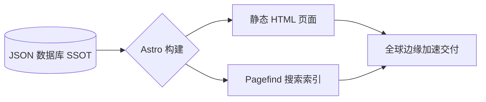

<div align="center">


# CCUS Policy Hub | 全球 CCUS 政策与设施数据库
### 全球碳捕集、利用与封存领域的智能化知识基础设施

[](https://github.com/liuh886/ccus-policy-hub/actions)
[](https://astro.build)
[](LICENSE)

[**English Version**](./README.md) | [**简体中文**] | [**在线预览**](https://liuh886.github.io/ccus-policy-hub/)

</div>

---

## 🌟 项目概览

**CCUS Policy Hub** 是一个面向全球 CCUS（碳捕集、利用与封存）领域的专业级开源知识基础设施。本项目旨在解决行业核心痛点：监管文本碎片化、数据难以结构化对比。

通过集成 **IEA 全球设施数据库** 与 **GCCSI 政策与法律就绪度 (PLR) 指标**，我们将复杂的法律条文转化为可量化、可对标的数字化洞察，为研究者、政策制定者及投资者提供决策支持。

---

## ✨ 核心特性

### 1. 全球政策准入控制台 (Access Console)
通过交互式世界地图，实时透视各区域政策强度。目前已覆盖 **35+ 个核心经济体**，提供从激励规模到准入要求的全方位信息。

> **亮点**：首页集成实时政策数量统计，动态展示全球版图扩张。

### 2. PLR 3.0 对比矩阵
支持超越单纯财务维度的深度法律对标：
- **孔隙使用权 (Pore Space Rights)**：明确地下封存空间的法律权属。
- **长期责任转移**：量化场址关闭后责任移交政府的时间线。
- **CO2 法律定义**：区分其为“废弃物”还是“商品”属性。
- **审批周期 (Lead Times)**：对比各国从申请到获批的预估时间。

### 3. 设施-政策智能图谱
全球 800+ 个 CCUS 项目自动挂载所属法域的法律条款。点击“北极光 (Northern Lights)”或“大庆敖南”等具体设施，即可查看其背后的核心激励机制与监管依据。

---

## 🏗️ 技术架构

本项目采用 **"数据驱动型 SSG" (Static Site Generation)** 架构，确保极致的访问性能与数据保真度。



- **SSOT (单源真相)**：所有元数据统一由 `src/data/policy_database.json` 管理。
- **Astro 5**: 使用最新的内容层 (Content Layer) API 进行高性能渲染。
- **Pagefind**: 毫秒级的全文检索，无需后端服务器。

---

## 🛠️ 维护与治理

### 开发环境
```bash
git clone https://github.com/liuh886/ccus-policy-hub.git
cd ccus-policy-hub
pnpm install
pnpm dev
```

### 数据治理规约
我们遵循严格的 **数据库治理技能 (ccus-db-governance)**，确保双语内容 1:1 对齐，并强制使用 Node.js 写入规范以彻底杜绝乱码问题。

---

<div align="center">
  <sub>liuh886 为全球气候社区倾力打造</sub>
</div>
