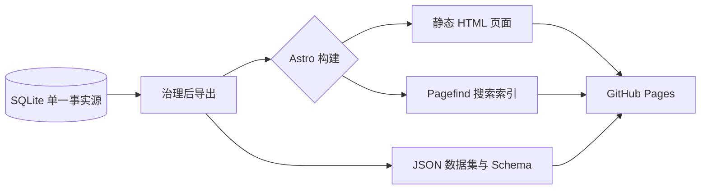

<div align="center">


# CCUS Policy Hub｜全球 CCUS 政策与设施知识基础设施

### 面向碳捕集、利用与封存的可信政策情报与决策支持

[](https://github.com/liuh886/ccus-policy-hub/actions)
[](https://astro.build)
[](LICENSE)
[](https://doi.org/10.5281/zenodo.21110615)

[**English Version**](./README.md) | [**简体中文**] | [**在线预览**](https://liuh886.github.io/ccus-policy-hub/)

</div>

---

## 项目概览

**CCUS Policy Hub** 是一个面向全球碳捕集、利用与封存领域的开源知识与决策支持基础设施。项目将分散的监管文本、国家治理条件与设施记录转化为结构化、双语、可审计的数据，为研究者、政策制定者、项目开发者、投资者和 AI 系统提供可信的事实基础。

项目遵循“可信优先”原则：结构化数据、来源和审计状态界定事实边界；可视化分析与后续 AI Agent 在该边界内开展推理，而不是用流畅文本替代证据。

### 当前治理数据快照

- **130 项政策记录**，其中 **116 项已验证**、**14 项为草稿**；
- **1,110 个设施记录**，对应 2026-Q2 设施数据版本及人工治理补充；
- **66 个国家治理画像**；
- 治理数据具备中英文发布层；
- 提供 JSON 数据接口、Schema、质量指标与数据版本信息。

以上数字描述完整治理数据集。网站中的具体页面可能因审核状态、发布范围、项目状态或分析筛选而显示更小的子集。

> **AI 原生基础设施**：项目通过结构化数据接口、Schema、质量指标和已知限制，为气候政策 Agent 提供可审计的 Grounding Source。

---

## OpenAI Build Week

本项目的 Build Week 产品方向为：

### CCUS Policy Hub: Project Readiness Agent

> An evidence-backed AI agent that turns fragmented CCUS regulations into project-ready decisions, comparing jurisdictions, incentives, permits, liabilities and policy gaps with traceable sources.

该 Agent 将作为现有 CCUS Policy Hub 的能力延伸，而不是一个与数据治理体系脱节的通用聊天框。用户描述拟议 CCUS 项目后，系统将生成包含证据引用、置信度标记和待核实缺口的结构化项目就绪度简报。

参赛定位、开发拆分和可信度底线见 [BUILD_WEEK.md](BUILD_WEEK.md)。

---

## 核心能力

### 1. 全球政策检索与比较

通过地图、全文检索与比较页面浏览政策记录和国家治理画像，并对激励、法定要求、市场机制、战略部署、技术治理及七项监管支柱进行结构化比较。

### 2. 设施与产能情报

按地区、状态、价值链类型、时间和记录产能探索 **1,110 个 CCUS 设施记录**。项目对产能趋势明确采用“项目记录聚合”口径，不应将其直接理解为可交付的净捕集能力或净封存能力。

### 3. 国家治理画像

对比各法域的关键治理条件，包括：

- 孔隙空间权属；
- 长期责任转移与责任期限；
- 财务担保；
- 审批周期；
- CO₂ 的监管属性与法律定位；
- 跨境运输规则。

### 4. 带置信度的设施—政策关联

当前设施与政策之间的公开关联均属于**国家层面的背景关联**，置信度较低。它只能说明某个设施与某项政策处于同一法域，不能单独证明某条法律条款直接支持、资助或约束了某个具体设施。

关系模型支持后续逐步升级：

| 层级 | 置信度 | 含义 |
| --- | --- | --- |
| 国家 | 低（0.3） | 设施与政策位于同一法域 |
| 行业 | 中（0.6） | 政策适用范围与设施行业或价值链环节匹配 |
| 证据 | 高（0.9） | 原始来源明确连接该政策与具体设施 |

详见 [设施—政策关系模型](docs/facility-policy-relationship-model.md)。

### 5. 数据可信度与审计

质量层主动披露而非隐藏数据缺口，包括来源和 URL 缺失、坐标精度、审核状态、产能完整度以及设施—政策关联置信度。

可访问 [数据质量面板](https://liuh886.github.io/ccus-policy-hub/quality/) 查看当前快照。

---

## 技术架构

平台采用数据驱动的静态站点架构，以保证发布流程可复现、访问性能稳定，并为机器读取提供静态接口。


```mermaid
graph LR
    A[(SQLite 单一事实源)] --> B[治理后导出]
    B --> C{Astro 构建}
    C --> D[静态 HTML 页面]
    C --> E[Pagefind 搜索索引]
    B --> F[JSON 数据集与 Schema]
    D --> G[GitHub Pages]
    E --> G
    F --> G
```

- **单一事实源**：`agent/ccus-ai-agent/db/ccus_master.sqlite`；
- **单向发布**：SQLite → 受治理的 Markdown 与 JSON 导出；
- **Astro 5**：生成静态内容与分析页面；
- **Pagefind**：无需运行时搜索后端的全文检索；
- **质量门禁**：代码检查、测试、类型检查、数据库深度审计、治理数据导出及完整构建。

---

## 机器可读数据接口

| 接口 | 说明 |
| --- | --- |
| `/data/manifest.json` | 数据集、Schema 与文档索引 |
| `/data/policies.json` | 结构化 CCUS 政策与分析字段 |
| `/data/facilities.json` | 设施、位置、状态与产能字段 |
| `/data/countries.json` | 国家治理画像与监管支柱 |
| `/data/quality.json` | 数据质量指标与审计状态 |
| `/data/dataset-versions.json` | 数据版本信息 |
| `/llms.txt` | 面向 AI 系统的简要说明 |
| `/llms-full.txt` | 完整字段和限制说明 |

JSON Schema 发布于 `/data/schemas/`。

### 已知限制

- 设施—政策关联目前均为国家层面的背景关联；
- 坐标精度分为精确、州/省级和国家级锚点；
- 部分政策记录仍缺少原始来源或 URL；
- 部分设施记录缺少可用的估算产能；
- 政策状态和适用性可能在记录的审计日期后发生变化。

使用数据前应检查 `/data/quality.json` 与 `/data/dataset-versions.json`。

---

## 开发与治理

```bash
git clone https://github.com/liuh886/ccus-policy-hub.git
cd ccus-policy-hub
pnpm install
pnpm dev
```

数据治理修改应首先进入 SQLite，并通过维护脚本导出。`src/content/` 和 `public/data/` 下的文件属于发布产物，不是独立事实源。

核心检查命令：

```bash
pnpm lint
pnpm test
pnpm astro check
pnpm manage:db:audit:deep
pnpm manage:db:quality:export
pnpm manage:db:data:export
pnpm build
```

GitHub Pages 部署将在发布前运行同一组阻断式可信度检查。

---

## 引用

如在研究、政策分析或衍生数据集中使用本项目，请引用 Zenodo 归档记录：

> Liu, Z. **CCUS Policy Hub: Global Intelligence Infrastructure for Carbon Capture, Utilization, and Storage**. Zenodo. https://doi.org/10.5281/zenodo.21110615

---

<div align="center">
  <sub>liuh886 为全球气候与 CCUS 社区打造</sub>
</div>
