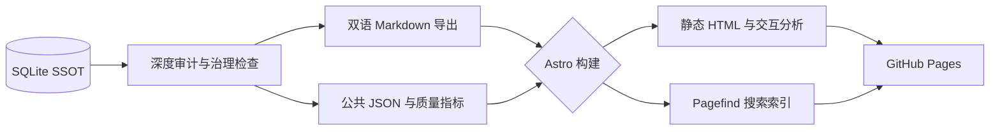

<div align="center">


# CCUS Policy Hub｜全球 CCUS 政策与设施数据库

### 面向碳捕集、利用与封存的全球智能化知识基础设施

[](https://github.com/liuh886/ccus-policy-hub/actions)
[](https://astro.build)
[](LICENSE)
[](https://doi.org/10.5281/zenodo.21110615)

[**English**](./README.md) | [**简体中文**] | [**在线预览**](https://liuh886.github.io/ccus-policy-hub/)

</div>

---

## 项目概览

**CCUS Policy Hub** 是一个面向全球 CCUS（碳捕集、利用与封存）领域的开源研究与数据平台，用于比较不同国家和地区的政策框架、设施部署、项目记录能力与治理成熟度。

平台将过去往往被割裂研究的三类信息连接起来：

- **政策与监管**：激励机制、法律框架、审批、责任、MRV 与跨境规则。
- **设施与项目记录**：状态、类型、行业、区域、能力、位置、枢纽、合作方与关键时间节点。
- **治理与部署分析**：国家对标、区域项目管线、确定性能力与数据质量证据。

平台面向研究人员、政策制定者、市场分析师、投资者和 AI Agent，提供结构化、可审计的知识基础，而不是一组彼此割裂的网页资料。

## 数据快照

| 数据集 | 当前快照 |
| --- | ---: |
| 政策 | **130 项** |
| 设施记录 | **1,110 条** |
| 国家治理档案 | **66 个** |
| 设施数据集版本 | **2026-Q2** |
| 政策数据审查状态 | **Active** |
| 最近检查日期 | **2026-06-24** |

> 上述数量描述的是已发布数据集中的记录。设施记录不一定与现实世界中的独立项目一一对应，尤其是在捕集、运输、封存和全链条环节被分别记录的情况下。

## 平台能够回答什么问题

- 不同法域的 CCUS 激励、审批、封存空间权利、长期责任与 MRV 制度有何差异？
- 在运、在建与规划中的设施记录主要集中在哪些国家和地区？
- 公开项目记录能力中，有多少仍处于规划阶段，又有多少已经进入在建或在运阶段？
- 哪些国家和地区同时具备较强的治理能力与较大的项目部署规模？

---

## 核心能力

### 1. 全球政策准入控制台

通过交互式世界地图查看国家和地区的政策框架、市场准入条件、激励机制、法律权重与政策状态。

- 提供中英文双语政策内容。
- 使用结构化政策分类与分析维度。
- 基于最新发布快照生成政策数量与区域覆盖指标。
- 可直接查看政策详情、来源、日期与关联设施。

### 2. 全球设施情报

通过地图、筛选器、可搜索卡片和项目详情页探索全球设施数据集。

- 支持按国家、区域、行业、状态与设施类型筛选。
- 查看项目记录能力、坐标精度、枢纽、运营方、合作方与关键时间节点。
- 区分在运、在建、规划、取消、暂停和退役记录。
- 检查每条记录可用的数据质量与来源字段。

### 3. CCUS 项目记录能力增长趋势

首页时间序列工作区用于展示全球 CCUS 项目记录能力如何沿项目管线累积。

- 支持从历史记录到未来公告项目的时间窗口调整。
- 支持 Capture、Transport、T&S、Storage、Full chain 与 CCU 类型筛选。
- 使用两条一致口径的序列：
  - **Pipeline（公开管线）** = Planned + Under construction + Operational。
  - **Committed（确定性项目）** = Under construction + Operational。
- 当前视图最右侧年份决定首页显示的项目记录能力总值。
- 项目记录年份按 **operation → FID → announcement** 的优先级确定。

> 项目记录能力是对公开项目记录的加总，不应解释为净可交付捕集能力或净地质封存能力。

### 4. 2026 全球项目格局

当前数据快照在增长趋势之外，进一步展示项目成熟阶段与区域集中度。

- **项目状态构成**：展示有效项目组合中的在运、在建与规划记录。
- **各区域 Pipeline vs Committed**：通过嵌套条形图明确 Committed 是 Pipeline 的子集。
- 可在**项目记录能力**与**项目数量**之间切换。
- 自动生成以下洞察：
  - 全球能力兑现度。
  - 最大公开管线区域。
  - 最大确定性能力区域。
  - 能力数据覆盖率。

取消、暂停和退役记录单独披露，不与有效项目组合混合统计。

### 5. 治理对标与部署比较

治理比较工作区不依赖单一成熟度分数，而是展示国家治理能力背后的制度结构。

- 对比孔隙空间权利、责任转移、财务保障、审批、CO₂ 法律定位与跨境规则等监管支柱。
- 对选定国家进行治理能力对标。
- 通过 Governance–Deployment Matrix 连接制度能力与项目记录部署规模。
- 使用全球成熟度视图识别治理领先者、部署领先者与实施缺口。
- 在可视化旁同步呈现方法说明与证据边界。

### 6. 数据可信度、质量与 AI 可读接口

平台将数据治理视为产品能力，而不是后台维护工作。

- SQLite 单一事实来源（SSOT）。
- 双语导出与一致性检查。
- CI 中阻断式的深度审计。
- 公共质量看板与数据版本元数据。
- 静态 JSON 接口与 JSON Schema。
- 面向 AI Agent 的 `llms.txt` 与 `llms-full.txt` 文档。

---

## 方法与限制

### 项目记录口径

- 优先使用维护后的估算能力；如无估算值，则按照仓库能力规则使用公告区间。
- 没有可用能力数据的记录仍进入项目数量统计，但在能力加总中贡献 `0 Mtpa`。
- Capture、Transport、Storage 和 Full-chain 记录可能属于同一条更大的价值链。
- 因此，跨类型加总得到的是分析性项目记录指标，而不是净物理系统能力。

### 数据快照口径

- **2026 全球项目格局**描述的是 2026 版数据集当前记录的状态。
- 这不意味着所有展示项目都在 2026 年公告、建设或投运。
- 当前状态字段不能用于重建某个项目在历史年份中的实际状态。

### 设施—政策关系置信度

设施记录与所在法域的相关政策框架建立结构化关联，用于提供治理背景。除非存在直接证据，否则不应将这些关联解释为已经核验的项目专项法律适用关系。

| 关系层级 | 指示性置信度 | 含义 |
| --- | ---: | --- |
| 国家 | 低 | 设施与政策属于同一法域 |
| 行业 | 中 | 设施行业与政策适用范围匹配 |
| 直接证据 | 高 | 来源明确连接政策与设施 |

完整设计见 [设施—政策关系模型](docs/facility-policy-relationship-model.md)。

### 地理精度

坐标可能为精确、州/省级或国家级。国家级坐标仅用于地图可视化锚点，不应解释为已经核验的项目真实位置。

---

## 数据架构

平台采用受数据治理约束的静态网站架构：前端站点是静态的，但其源数据通过可审计的数据库流程维护。


```mermaid
graph LR
    A[(SQLite SSOT)] --> B[深度审计与治理检查]
    B --> C[双语 Markdown 导出]
    B --> D[公共 JSON 与质量指标]
    C --> E{Astro 构建}
    D --> E
    E --> F[静态 HTML 与交互分析]
    E --> G[Pagefind 搜索索引]
    F --> H[GitHub Pages]
    G --> H
```

- **单一事实来源**：`agent/ccus-ai-agent/db/ccus_master.sqlite`。
- **发布内容层**：`src/content/policies/{en,zh}` 与 `src/content/facilities/{en,zh}`。
- **公共数据层**：`public/data/*.json` 与 `public/data/schemas/`。
- **前端技术**：Astro 5、Tailwind CSS、Chart.js、Leaflet 与 Pagefind。
- **部署方式**：通过 GitHub Pages 发布静态站点。

---

## AI 可读数据接口

平台为 AI Agent、研究人员和脚本提供静态数据接口：

| 接口 | 说明 |
| --- | --- |
| `/data/manifest.json` | 数据集、Schema 与文档索引 |
| `/data/policies.json` | 130 条政策记录及分析数据 |
| `/data/facilities.json` | 1,110 条设施记录及能力、位置数据 |
| `/data/countries.json` | 66 个国家治理档案及监管支柱 |
| `/data/quality.json` | 数据质量指标与审计状态 |
| `/data/dataset-versions.json` | 数据版本与最近检查时间 |
| `/data/schemas/` | 用于验证的 JSON Schema |
| `/llms.txt` | 面向 AI Agent 的简明文档 |
| `/llms-full.txt` | 完整数据与字段文档 |

推荐使用流程：

1. 获取 `/data/manifest.json`，发现可用资源。
2. 使用已发布 Schema 验证数据。
3. 在形成结论前检查 `/data/quality.json` 与版本元数据。
4. 使用能力和关系字段时保留原有方法说明与边界。

---

## 开发与数据治理

### 本地开发

```bash
git clone https://github.com/liuh886/ccus-policy-hub.git
cd ccus-policy-hub
pnpm install
pnpm dev
```

### 验证与生产构建

```bash
pnpm lint
pnpm test
pnpm astro check
pnpm manage:db:audit:deep
pnpm manage:db:quality:export
pnpm manage:db:data:export
pnpm build
```

### 受治理约束的内容工作流

```text
SQLite 修改
  → 深度审计
  → 双语 Markdown 导出
  → 质量指标与公共数据生成
  → Astro 生产构建
  → 人工审查与部署
```

治理规则：

- 权威内容修改应在 SQLite 中完成，而不是直接修改生成后的 Markdown。
- `src/content/**/*.md` 是发布层，不是单一事实来源。
- Markdown 反向同步至 SQLite 仅用于迁移，并需要显式确认。
- 更新记录时应保留来源、审计日期、双语一致性和 URL。

---

## AI 辅助开发

项目将 AI 作为研究与工程协作工具，并置于人工审查的开发流程中。

### GPT-5.6

- 协助定义分析方法、指标边界与验收标准。
- 审查治理与部署逻辑的一致性。
- 设计双语信息架构、产品文案与视觉 QA 要求。
- 将研究判断转化为实现任务、测试与 PR 审查标准。

### Codex 与仓库 Agent

- 读取当前 GitHub 仓库并实施聚焦修改。
- 创建和更新 PR、测试与文档。
- 诊断 Astro、TypeScript、数据管线与 CI 问题。
- 在需要本地环境时，由本地 Codex 工作流完成接力验证。


```mermaid
graph LR
    A[研究问题] --> B[GPT-5.6 方法与验收标准]
    B --> C[Codex 或 GitHub 实现]
    C --> D[自动化测试与 CI]
    D --> E[人工审查]
    E --> F[合并与发布]
```

AI 生成的修改不会仅因为能够编译就被接受。数据定义、证据判断与发布决策仍由维护者审查。

---

## 引用

在研究、政策分析或衍生数据集中使用 **CCUS Policy Hub** 时，请引用 Zenodo 存档：

> Liu, Z. **CCUS Policy Hub: Global Intelligence Infrastructure for Carbon Capture, Utilization, and Storage**. Zenodo. https://doi.org/10.5281/zenodo.21110615

```bibtex
@software{liu_ccus_policy_hub,
  author = {Liu, Zhihao},
  title = {CCUS Policy Hub: Global Intelligence Infrastructure for Carbon Capture, Utilization, and Storage},
  publisher = {Zenodo},
  doi = {10.5281/zenodo.21110615},
  url = {https://doi.org/10.5281/zenodo.21110615}
}
```

## 许可证

代码采用 [MIT License](LICENSE) 发布。数据记录保留原始来源归属，复用时应同时保留上述方法、来源与限制说明。

---

<div align="center">
  <sub>由 <b>liuh886</b> 为全球气候与 CCUS 研究社区构建</sub>
</div>
